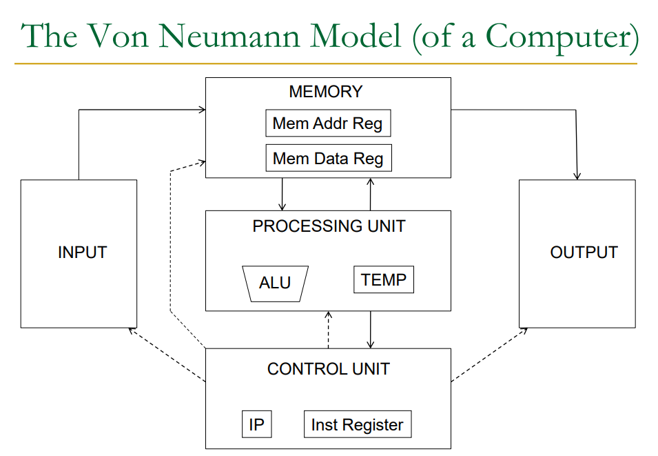

# Computer Architecture: Von Neumann Model and Beyond

## The Von Neumann Model

The Von Neumann model, also known as the Von Neumann architecture, is a fundamental design for electronic computers. It consists of several key components:

1. **Memory**: Stores both data and instructions
   - Memory Address Register (MAR)
   - Memory Data Register (MDR)

2. **Processing Unit**: Executes instructions
   - Arithmetic Logic Unit (ALU)
   - Temporary registers (TEMP)

3. **Control Unit**: Manages the execution flow
   - Instruction Pointer (IP)
   - Instruction Register

4. **Input**: Receives data from external sources

5. **Output**: Sends processed data to external devices

## Basic Architecture Components

Computer architecture generally comprises three main elements:

1. **Computation**: e.g., Arithmetic Logic Unit (ALU)
2. **Communication**: e.g., High Bandwidth Memory (HBM)
3. **Storage or Memory**: e.g., Random Access Memory (RAM)

## Computational Models

### 1. Von Neumann Model
- Instructions are fetched and executed in control flow order
- Sequential execution guided by the instruction pointer
- Used in most CPUs (e.g., x86, ARM)
- Generally easier to program and more versatile

### 2. Dataflow Model
- Instructions are fetched and executed in data flow order
- No instruction pointer
- Can execute multiple instructions simultaneously
- Execution is triggered by data availability
- Often used in specialized processors like GPUs

## Tradeoffs Between Models

- **Von Neumann (CPU-centric)**:
  - More general-purpose and flexible
  - Easier to program for a wide range of tasks
  - Sequential nature can be a bottleneck for certain parallel tasks

- **Dataflow (e.g., GPU-centric)**:
  - Excels at parallel processing
  - Can be more efficient for specific types of computations (e.g., graphics rendering, machine learning)
  - Programming model can be more complex

## Key Concepts

### Instruction Set Architecture (ISA)
- Defines the interface between hardware and software
- Specifies the set of instructions the hardware can execute
- Examples: x86, ARM, RISC-V

### Microarchitecture
- Specifies the underlying implementation of the ISA
- Determines how instructions are actually executed in hardware
- Can vary between different processors implementing the same ISA

# Microarchitecture and ISA Design Tradeoffs

Microarchitecture specifies the underlying implementation for the execution itself, and how the ISA will be implemented. 

There are concrete tradeoffs when picking an ISA and a microarchitecture design:

## 1. RISC vs. CISC

### RISC (Reduced Instruction Set Computing)
- **Pros**: 
  - Simpler hardware
  - Easier to pipeline
  - Potentially faster clock speeds
- **Cons**: 
  - May require more instructions to perform complex tasks

### CISC (Complex Instruction Set Computing)
- **Pros**: 
  - Can perform complex operations in a single instruction
  - Potentially more code-efficient
- **Cons**: 
  - More complex hardware
  - Harder to pipeline efficiently

## 2. Number of Registers

- More registers → Higher performance
- But: Can make hardware more complex and increase instruction encoding (e.g. more work for copiler)

## 3. Specialized vs. General Instructions

1. Specialized instructions:
   - Can do a very limited set of things
   - Better memory utilization and better packing of instructions 
   - But, can make hardware more complex 

2. Generalized instructions:
   - Can do a lot of things
   - May not be optimal for specific tasks

> **Highlight:** This is especially relevant for something like TPUs. They will have a more specialized instruction set since the goal is for them to do one specific thing very well, and everything else can be handled by a separate chip.

## 4. Instruction Level Parallelism

- Allows for parallel computing
- Can be harder to code
- Increases power consumption

# Systolic Arrays

## Goals of an accelerator from [here](https://www.youtube.com/watch?v=XkgtANeDrm8)
1. Simple, regular design 
2. Ability to parallelize 
3. Balance computation and I/O memory bandwidth 

Systolic arrays replace a single element with an array of elements which do specific operations 
> allows you to do a lot of computation from one piece of memory, decreases overall memory needs and bandwidth.  

This architecture is special because you are not necessarily doing thigs linearly (each cell can have a weight to it) and can be multi-dimensional. 

You can also store weights in each cell, and you can update them on the fly within each cell. 