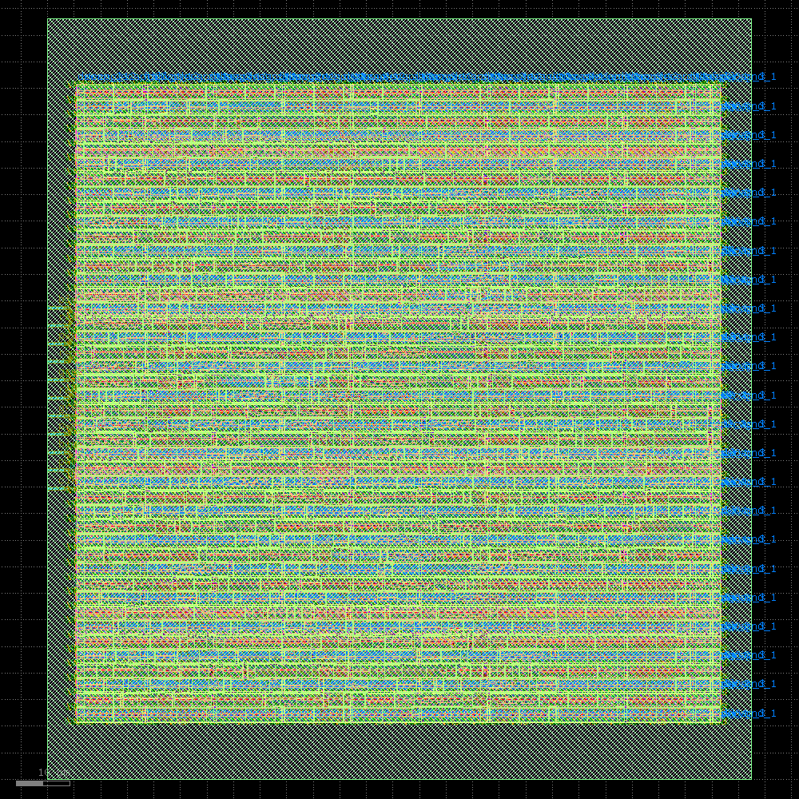

# Project Introduction 

I wanted to design a chip from scratch. Beginning with Verilog, I learned my way through HDL, RTL, computer architectures, and the entire chip design process. I started with some sample projects (e.g. implementing a Systolic Array) in Verilog and worked my way up to a robust project that I was happy with. 

## Final Product 

The result is a **RGB LED Mixer ASIC**. I describe the base functionality in Verilog, and using OpenLane's RTL to ASIC workflow, took the design through the chip desing process. The mixer is made of three parts: 

1. PWM Driver, built from scratch 
2. Digital Rotary Encoder, built from scratch 
3. LED-Driver that combines these modules to power 3 LEDs.

I wrote the testbenches for each of these modules in verilog. These files are visible in the project file. After confirming correct functinoality, I started on OpenLane's workflow and turned the design into an ASIC. 

> The chip design flow is showcased and annotated in a Jupyer Notebook I made. I describe and go through each step. You can find it [here](https://colab.research.google.com/drive/1cc1IAzJyq1mTwqI_kV7_VD_Q_9GUl906?usp=sharing). It is also available in this git repo [here](openlane_workflow.ipynb), though it may take a while to load. 

The final chip looks like this! 

  

Overall, I learned an incredible amount about chip design. This was the largest side project I have undertaken and I am happy with how it came out. [Here](https://x.com/aj_kourabi/status/1848785595708887177) is a twitter thread going over my learnings from the chip design process in particular. 

## Past Projects 
 
### **Systolic Array for Matrix Multiplication**. 

A systolic array is a form of architecture in which nodes are tightly couples and networked in a way that allows for streamlined parallel computing. It is used in AI Chips like Google's TPU for matrix multiplication. 

Because these cells are tightly coordinated and pipelines flow rhytmically, the array is called systolic (referring to the way the heart beats)

I wanted to better understand parallel architectures, and decided to implement a systolic array -- from scratch, in verilog. It was a robust learning expereince in which I was able to better understand parallel computing. It also enabled me to better understand the details between how TPUs and GPUs are different. 

There is one file, `block.v`, which describes the basic behaviour of a single processing element, and the other code describes putting together the array. 

### Traffic State Machine 
Simple program to learn state machines. 

### ALU and a Counter 
Other basic projects to understand Verilog and computer architecture better 